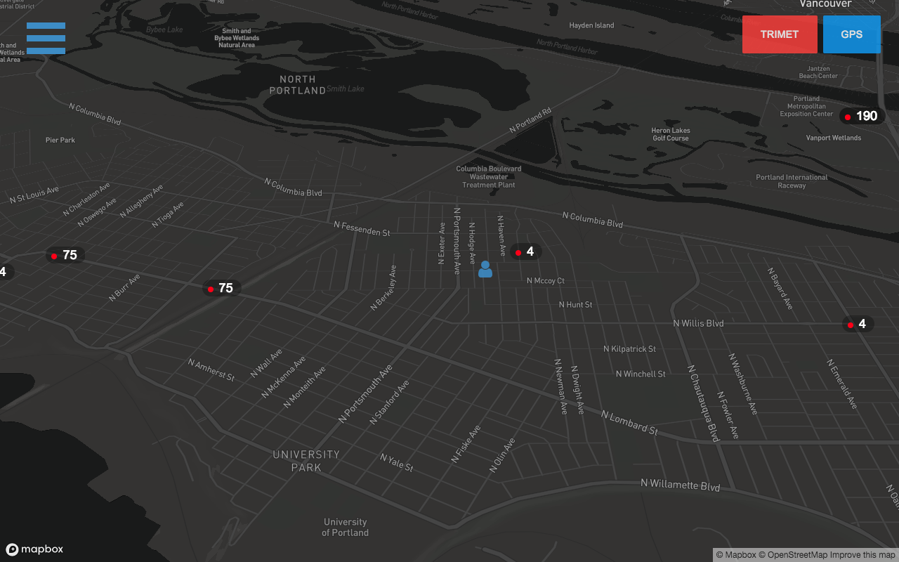

# tri-map
## Screenshot

## todo
1. Create Web Socket Server Scripts.
2. Transition client over to WebSocket connection.
3. Add Cache Service Worker functionality to load client faster.
4. Add vehicle type and heading visualizations to map.
5. Create logo and add to manifest.JSON
6. Complete the station.json file for all stations, maybe
   generate from API call... not sure how often stations change...
